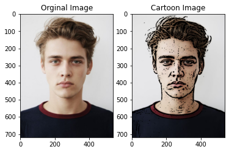

# Image_Cartoon

# project Idea:
Transform images into its cartoon. we will build a python application that will transform an image into its cartoon using machine learning libraries.

# Solution: 
we build a python application that will transform an image into its cartoon using OpenCV library.

# Results:

